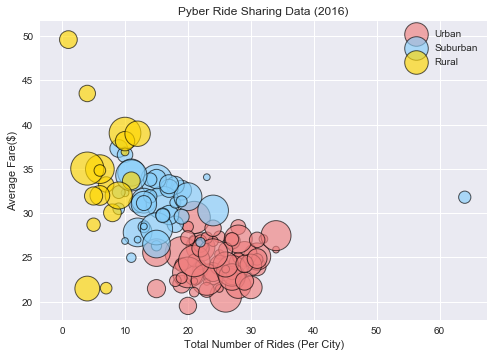
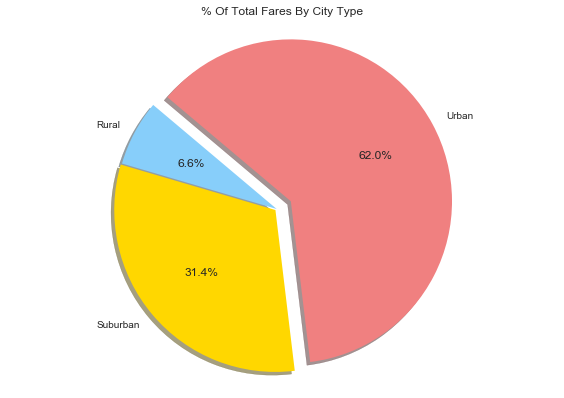
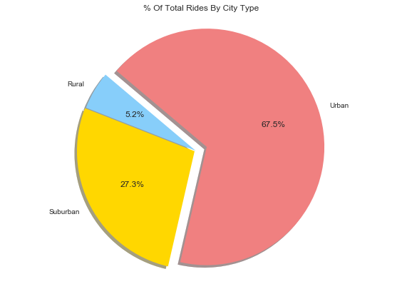
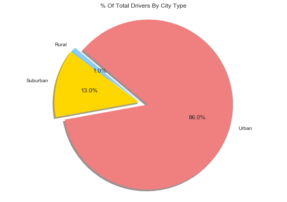

```python
import pandas as pd
import numpy as np
import seaborn as sns
import matplotlib.pyplot as plt
```


```python
city_df = pd.read_csv('./raw_data/city_data.csv')
ride_df = pd.read_csv('./raw_data/ride_data.csv')

city_ride_df = pd.merge(city_df, ride_df, on='city', how='left')
city_ride_df

fare_df = city_ride_df.groupby('city')
ave_fare_var = fare_df['fare'].mean()

num_ride_var = fare_df['city'].count()
num_ride_var

type_var = fare_df['type']

num_drive = fare_df['driver_count']
num_drive.max()

full_df = pd.DataFrame(
{
    "Average Fare ($)": ave_fare_var,
    "Total Number of Rides per City": num_ride_var,
    "Driver Count": num_drive.max(),
    "Type": type_var.max()
}
)
full_df
```


<div>
<style>
    .dataframe thead tr:only-child th {
        text-align: right;
    }

    .dataframe thead th {
        text-align: left;
    }

    .dataframe tbody tr th {
        vertical-align: top;
    }
</style>
<table border="1" class="dataframe">
  <thead>
    <tr style="text-align: right;">
      <th></th>
      <th>Average Fare ($)</th>
      <th>Driver Count</th>
      <th>Total Number of Rides per City</th>
      <th>Type</th>
    </tr>
    <tr>
      <th>city</th>
      <th></th>
      <th></th>
      <th></th>
      <th></th>
    </tr>
  </thead>
  <tbody>
    <tr>
      <th>Alvarezhaven</th>
      <td>23.928710</td>
      <td>21</td>
      <td>31</td>
      <td>Urban</td>
    </tr>
    <tr>
      <th>Alyssaberg</th>
      <td>20.609615</td>
      <td>67</td>
      <td>26</td>
      <td>Urban</td>
    </tr>
    <tr>
      <th>Anitamouth</th>
      <td>37.315556</td>
      <td>16</td>
      <td>9</td>
      <td>Suburban</td>
    </tr>
    <tr>
      <th>Antoniomouth</th>
      <td>23.625000</td>
      <td>21</td>
      <td>22</td>
      <td>Urban</td>
    </tr>
    <tr>
      <th>Aprilchester</th>
      <td>21.981579</td>
      <td>49</td>
      <td>19</td>
      <td>Urban</td>
    </tr>
    <tr>
      <th>Arnoldview</th>
      <td>25.106452</td>
      <td>41</td>
      <td>31</td>
      <td>Urban</td>
    </tr>
    <tr>
      <th>Campbellport</th>
      <td>33.711333</td>
      <td>26</td>
      <td>15</td>
      <td>Suburban</td>
    </tr>
    <tr>
      <th>Carrollbury</th>
      <td>36.606000</td>
      <td>4</td>
      <td>10</td>
      <td>Suburban</td>
    </tr>
    <tr>
      <th>Carrollfort</th>
      <td>25.395517</td>
      <td>55</td>
      <td>29</td>
      <td>Urban</td>
    </tr>
    <tr>
      <th>Clarkstad</th>
      <td>31.051667</td>
      <td>21</td>
      <td>12</td>
      <td>Suburban</td>
    </tr>
    <tr>
      <th>Conwaymouth</th>
      <td>34.591818</td>
      <td>18</td>
      <td>11</td>
      <td>Suburban</td>
    </tr>
    <tr>
      <th>Davidtown</th>
      <td>22.978095</td>
      <td>73</td>
      <td>21</td>
      <td>Urban</td>
    </tr>
    <tr>
      <th>Davistown</th>
      <td>21.497200</td>
      <td>25</td>
      <td>25</td>
      <td>Urban</td>
    </tr>
    <tr>
      <th>East Cherylfurt</th>
      <td>31.416154</td>
      <td>9</td>
      <td>13</td>
      <td>Suburban</td>
    </tr>
    <tr>
      <th>East Douglas</th>
      <td>26.169091</td>
      <td>12</td>
      <td>22</td>
      <td>Urban</td>
    </tr>
    <tr>
      <th>East Erin</th>
      <td>24.478214</td>
      <td>43</td>
      <td>28</td>
      <td>Urban</td>
    </tr>
    <tr>
      <th>East Jenniferchester</th>
      <td>32.599474</td>
      <td>22</td>
      <td>19</td>
      <td>Suburban</td>
    </tr>
    <tr>
      <th>East Leslie</th>
      <td>33.660909</td>
      <td>9</td>
      <td>11</td>
      <td>Rural</td>
    </tr>
    <tr>
      <th>East Stephen</th>
      <td>39.053000</td>
      <td>6</td>
      <td>10</td>
      <td>Rural</td>
    </tr>
    <tr>
      <th>East Troybury</th>
      <td>33.244286</td>
      <td>3</td>
      <td>7</td>
      <td>Rural</td>
    </tr>
    <tr>
      <th>Edwardsbury</th>
      <td>26.876667</td>
      <td>11</td>
      <td>27</td>
      <td>Urban</td>
    </tr>
    <tr>
      <th>Erikport</th>
      <td>30.043750</td>
      <td>3</td>
      <td>8</td>
      <td>Rural</td>
    </tr>
    <tr>
      <th>Eriktown</th>
      <td>25.478947</td>
      <td>15</td>
      <td>19</td>
      <td>Urban</td>
    </tr>
    <tr>
      <th>Floresberg</th>
      <td>32.310000</td>
      <td>7</td>
      <td>10</td>
      <td>Suburban</td>
    </tr>
    <tr>
      <th>Fosterside</th>
      <td>23.034583</td>
      <td>69</td>
      <td>24</td>
      <td>Urban</td>
    </tr>
    <tr>
      <th>Hernandezshire</th>
      <td>32.002222</td>
      <td>10</td>
      <td>9</td>
      <td>Rural</td>
    </tr>
    <tr>
      <th>Horneland</th>
      <td>21.482500</td>
      <td>8</td>
      <td>4</td>
      <td>Rural</td>
    </tr>
    <tr>
      <th>Jacksonfort</th>
      <td>32.006667</td>
      <td>6</td>
      <td>6</td>
      <td>Rural</td>
    </tr>
    <tr>
      <th>Jacobfort</th>
      <td>24.779355</td>
      <td>52</td>
      <td>31</td>
      <td>Urban</td>
    </tr>
    <tr>
      <th>Jasonfort</th>
      <td>27.831667</td>
      <td>25</td>
      <td>12</td>
      <td>Suburban</td>
    </tr>
    <tr>
      <th>...</th>
      <td>...</td>
      <td>...</td>
      <td>...</td>
      <td>...</td>
    </tr>
    <tr>
      <th>South Roy</th>
      <td>26.031364</td>
      <td>35</td>
      <td>22</td>
      <td>Urban</td>
    </tr>
    <tr>
      <th>South Shannonborough</th>
      <td>26.516667</td>
      <td>9</td>
      <td>15</td>
      <td>Suburban</td>
    </tr>
    <tr>
      <th>Spencertown</th>
      <td>23.681154</td>
      <td>68</td>
      <td>26</td>
      <td>Urban</td>
    </tr>
    <tr>
      <th>Stevensport</th>
      <td>31.948000</td>
      <td>6</td>
      <td>5</td>
      <td>Rural</td>
    </tr>
    <tr>
      <th>Stewartview</th>
      <td>21.614000</td>
      <td>49</td>
      <td>30</td>
      <td>Urban</td>
    </tr>
    <tr>
      <th>Swansonbury</th>
      <td>27.464706</td>
      <td>64</td>
      <td>34</td>
      <td>Urban</td>
    </tr>
    <tr>
      <th>Thomastown</th>
      <td>30.308333</td>
      <td>1</td>
      <td>24</td>
      <td>Suburban</td>
    </tr>
    <tr>
      <th>Tiffanyton</th>
      <td>28.510000</td>
      <td>21</td>
      <td>13</td>
      <td>Suburban</td>
    </tr>
    <tr>
      <th>Torresshire</th>
      <td>24.207308</td>
      <td>70</td>
      <td>26</td>
      <td>Urban</td>
    </tr>
    <tr>
      <th>Travisville</th>
      <td>27.220870</td>
      <td>37</td>
      <td>23</td>
      <td>Urban</td>
    </tr>
    <tr>
      <th>Vickimouth</th>
      <td>21.474667</td>
      <td>13</td>
      <td>15</td>
      <td>Urban</td>
    </tr>
    <tr>
      <th>Webstertown</th>
      <td>29.721250</td>
      <td>26</td>
      <td>16</td>
      <td>Suburban</td>
    </tr>
    <tr>
      <th>West Alexis</th>
      <td>19.523000</td>
      <td>47</td>
      <td>20</td>
      <td>Urban</td>
    </tr>
    <tr>
      <th>West Brandy</th>
      <td>24.157667</td>
      <td>12</td>
      <td>30</td>
      <td>Urban</td>
    </tr>
    <tr>
      <th>West Brittanyton</th>
      <td>25.436250</td>
      <td>9</td>
      <td>24</td>
      <td>Urban</td>
    </tr>
    <tr>
      <th>West Dawnfurt</th>
      <td>22.330345</td>
      <td>34</td>
      <td>29</td>
      <td>Urban</td>
    </tr>
    <tr>
      <th>West Evan</th>
      <td>27.013333</td>
      <td>4</td>
      <td>12</td>
      <td>Suburban</td>
    </tr>
    <tr>
      <th>West Jefferyfurt</th>
      <td>21.072857</td>
      <td>65</td>
      <td>21</td>
      <td>Urban</td>
    </tr>
    <tr>
      <th>West Kevintown</th>
      <td>21.528571</td>
      <td>5</td>
      <td>7</td>
      <td>Rural</td>
    </tr>
    <tr>
      <th>West Oscar</th>
      <td>24.280000</td>
      <td>11</td>
      <td>29</td>
      <td>Urban</td>
    </tr>
    <tr>
      <th>West Pamelaborough</th>
      <td>33.799286</td>
      <td>27</td>
      <td>14</td>
      <td>Suburban</td>
    </tr>
    <tr>
      <th>West Paulport</th>
      <td>33.278235</td>
      <td>5</td>
      <td>17</td>
      <td>Suburban</td>
    </tr>
    <tr>
      <th>West Peter</th>
      <td>24.875484</td>
      <td>61</td>
      <td>31</td>
      <td>Urban</td>
    </tr>
    <tr>
      <th>West Sydneyhaven</th>
      <td>22.368333</td>
      <td>70</td>
      <td>18</td>
      <td>Urban</td>
    </tr>
    <tr>
      <th>West Tony</th>
      <td>29.609474</td>
      <td>17</td>
      <td>19</td>
      <td>Suburban</td>
    </tr>
    <tr>
      <th>Williamchester</th>
      <td>34.278182</td>
      <td>26</td>
      <td>11</td>
      <td>Suburban</td>
    </tr>
    <tr>
      <th>Williamshire</th>
      <td>26.990323</td>
      <td>70</td>
      <td>31</td>
      <td>Urban</td>
    </tr>
    <tr>
      <th>Wiseborough</th>
      <td>22.676842</td>
      <td>55</td>
      <td>19</td>
      <td>Urban</td>
    </tr>
    <tr>
      <th>Yolandafurt</th>
      <td>27.205500</td>
      <td>7</td>
      <td>20</td>
      <td>Urban</td>
    </tr>
    <tr>
      <th>Zimmermanmouth</th>
      <td>28.301667</td>
      <td>45</td>
      <td>24</td>
      <td>Urban</td>
    </tr>
  </tbody>
</table>
<p>125 rows × 4 columns</p>
</div>


```python
#Gold, Light Sky Blue, and Light Coral
handles = ['Urban', 'Suburban', 'Rural']
plt.scatter(
    full_df['Total Number of Rides per City'][full_df["Type"] == 'Urban'], 
    full_df['Average Fare ($)'][full_df["Type"] == 'Urban'],
    s=full_df['Driver Count']*15,
    marker='o', 
    c='lightcoral',
    edgecolors='black',
    alpha=0.65,
    linewidth=1
)
plt.scatter(
    full_df['Total Number of Rides per City'][full_df["Type"] == 'Suburban'], 
    full_df['Average Fare ($)'][full_df["Type"] == 'Suburban'],
    s=full_df['Driver Count']*15,
    marker='o', 
    c='lightskyblue',
    edgecolors='black',
    alpha=0.65,
    linewidth=1
)
plt.scatter(
    full_df['Total Number of Rides per City'][full_df["Type"] == 'Rural'], 
    full_df['Average Fare ($)'][full_df["Type"] == 'Rural'],
    s=full_df['Driver Count']*15,
    marker='o', 
    c='gold',
    edgecolors='black',
    alpha=0.65,
    linewidth=1
)

plt.xlabel('Total Number of Rides (Per City)')
plt.ylabel('Average Fare($)')
plt.title('Pyber Ride Sharing Data (2016)')
plt.legend(handles, loc="upper right")
```


    <matplotlib.legend.Legend at 0x13df0e0f0>


```python
plt.show()
```





```python
colors = ['lightskyblue', 'gold', 'lightcoral']
types = ['Rural', 'Suburban', 'Urban']
type_df = city_ride_df.groupby('type')
type_df.max()

```


<div>
<style>
    .dataframe thead tr:only-child th {
        text-align: right;
    }

    .dataframe thead th {
        text-align: left;
    }

    .dataframe tbody tr th {
        vertical-align: top;
    }
</style>
<table border="1" class="dataframe">
  <thead>
    <tr style="text-align: right;">
      <th></th>
      <th>city</th>
      <th>driver_count</th>
      <th>date</th>
      <th>fare</th>
      <th>ride_id</th>
    </tr>
    <tr>
      <th>type</th>
      <th></th>
      <th></th>
      <th></th>
      <th></th>
      <th></th>
    </tr>
  </thead>
  <tbody>
    <tr>
      <th>Rural</th>
      <td>West Kevintown</td>
      <td>10</td>
      <td>2016-11-28 09:09:15</td>
      <td>59.65</td>
      <td>9985496304508</td>
    </tr>
    <tr>
      <th>Suburban</th>
      <td>Williamchester</td>
      <td>27</td>
      <td>2016-12-04 15:42:42</td>
      <td>49.95</td>
      <td>9976923455740</td>
    </tr>
    <tr>
      <th>Urban</th>
      <td>Zimmermanmouth</td>
      <td>73</td>
      <td>2016-12-05 01:52:05</td>
      <td>44.99</td>
      <td>9997901376574</td>
    </tr>
  </tbody>
</table>
</div>


```python
type_df['fare'].sum()
#64669.12
```


    type
    Rural        4255.09
    Suburban    20335.69
    Urban       40078.34
    Name: fare, dtype: float64


```python
type_df['driver_count'].sum()
#74958
```


    type
    Rural         727
    Suburban     9730
    Urban       64501
    Name: driver_count, dtype: int64


```python
type_df['city'].count()
#2407
```


    type
    Rural        125
    Suburban     657
    Urban       1625
    Name: city, dtype: int64


```python
plt.pie(
    type_df['fare'].sum(),
    labels = types,
    shadow=True,
    colors=colors,
    explode=(0,.01,.1),
    autopct='%1.1f%%',
    startangle=140
)

plt.axis('equal')
plt.tight_layout()
plt.title('% Of Total Fares By City Type')

plt.show()


```





```python
plt.pie(
    type_df['city'].count(),
    labels=type_df['type'].max(),
    shadow=True,
    colors=colors,
    explode=(0,.01,.1),
    autopct='%1.1f%%',
    startangle=140
)

plt.axis('equal')
plt.tight_layout()
plt.title('% Of Total Rides By City Type')

plt.show()
```





```python
plt.pie(
    type_df['driver_count'].sum(),
    labels=type_df['type'].max(),
    shadow=True,
    colors=colors,
    explode=(0,.01,.1),
    autopct='%1.1f%%',
    startangle=140
)

plt.axis('equal')
plt.tight_layout()
plt.title('% Of Total Drivers By City Type')

plt.show()
```





```python

```
