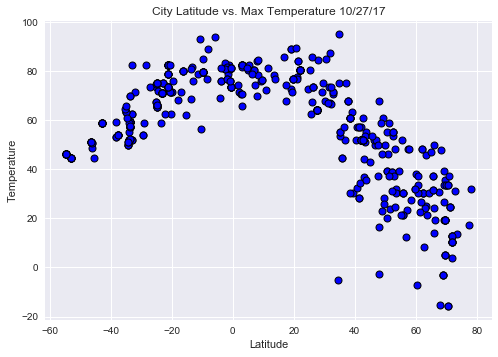
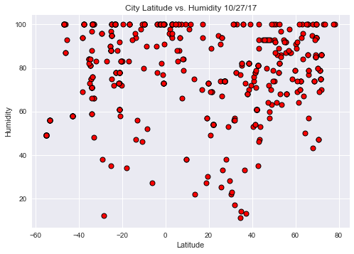
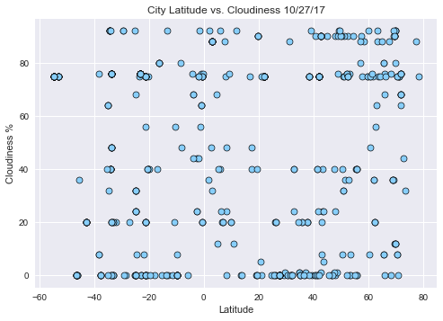
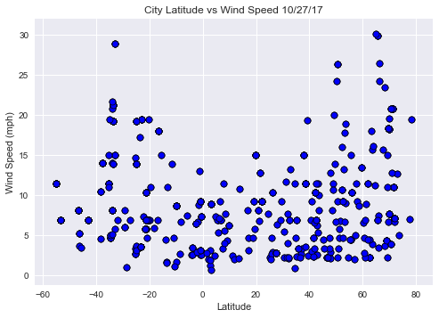

```python
#import dependencies
import requests as req
import json
import pandas as pd
import numpy as np
import matplotlib.pyplot as plt
import seaborn as sns
from citipy import citipy
import random as rand
```


```python
#create variables for your credentials and queries
api_key = "
cities = []
weather_data = []

url = "http://api.openweathermap.org/data/2.5/weather?"
units = "imperial"

# Build partial query URL
query_url = url + "appid=" + api_key + "&units=" + units + "&q="
```


```python
# Some random coordinates

i = 0
#loop 500 times to create a list of random cities, use citipy. Append those cities to the list
for i in range(500):
    coordinates = [(rand.randint(-90, 90), rand.randint(-180, 180))]
    for coordinate_pair in coordinates:
        lat, lon = coordinate_pair
        nearest_city_obj = (citipy.nearest_city(lat, lon))
        name = nearest_city_obj.city_name
        country_code = nearest_city_obj.country_code
        cities.append(name)    
        i += 1

```


```python
len(cities)
```


    500


```python
#loop through the list
for city in cities:
    response = req.get(query_url + city).json()
    weather_data.append(response)

```


```python
weather_data[36]
```


    {'base': 'stations',
     'clouds': {'all': 76},
     'cod': 200,
     'coord': {'lat': -4.13, 'lon': 37.95},
     'dt': 1509054967,
     'id': 156918,
     'main': {'grnd_level': 923.75,
      'humidity': 90,
      'pressure': 923.75,
      'sea_level': 1024.82,
      'temp': 68.91,
      'temp_max': 68.91,
      'temp_min': 68.91},
     'name': 'Kisiwani',
     'sys': {'country': 'TZ',
      'message': 0.1587,
      'sunrise': 1508987092,
      'sunset': 1509031154},
     'weather': [{'description': 'broken clouds',
       'icon': '04n',
       'id': 803,
       'main': 'Clouds'}],
     'wind': {'deg': 105.502, 'speed': 2.59}}


```python
len(weather_data)
```


    500


```python
#create variable lists to hold the information you need
#for data in weather_data:   
    #try:
city_name = [data.get('name') for data in weather_data]
country_code = [data.get('sys').get('country')for data in weather_data]
lon_data = [data.get('coord').get('lon')for data in weather_data]
lat_data = [data.get('coord').get('lat')for data in weather_data]
humidity = [data.get('main').get('humidity')for data in weather_data]
clouds = [data.get('clouds').get('all')for data in weather_data]
temp_max = [data.get('main').get('temp_max')for data in weather_data]
wind_spd = [data.get('wind').get('speed')for data in weather_data]
    #except:
        #continue


full_df = pd.DataFrame(
{
    "City Name": city_name,
    "Country Code": country_code,
    "Longitude": lon_data,
    "Latitude": lat_data,
    "Humidity": humidity,
    "Clouds": clouds,
    "Max Temperature": temp_max,
    "Wind Speed": wind_spd,
}
)
full_df.head(37)
```


<div>
<style>
    .dataframe thead tr:only-child th {
        text-align: right;
    }

    .dataframe thead th {
        text-align: left;
    }

    .dataframe tbody tr th {
        vertical-align: top;
    }
</style>
<table border="1" class="dataframe">
  <thead>
    <tr style="text-align: right;">
      <th></th>
      <th>City Name</th>
      <th>Clouds</th>
      <th>Country Code</th>
      <th>Humidity</th>
      <th>Latitude</th>
      <th>Longitude</th>
      <th>Max Temperature</th>
      <th>Wind Speed</th>
    </tr>
  </thead>
  <tbody>
    <tr>
      <th>0</th>
      <td>Trelleborg</td>
      <td>40</td>
      <td>SE</td>
      <td>87</td>
      <td>55.38</td>
      <td>13.16</td>
      <td>51.80</td>
      <td>14.99</td>
    </tr>
    <tr>
      <th>1</th>
      <td>Mathura</td>
      <td>0</td>
      <td>IN</td>
      <td>74</td>
      <td>27.50</td>
      <td>77.68</td>
      <td>64.23</td>
      <td>2.82</td>
    </tr>
    <tr>
      <th>2</th>
      <td>San Cristobal</td>
      <td>75</td>
      <td>VE</td>
      <td>66</td>
      <td>7.77</td>
      <td>-72.22</td>
      <td>84.20</td>
      <td>11.41</td>
    </tr>
    <tr>
      <th>3</th>
      <td>Albany</td>
      <td>90</td>
      <td>US</td>
      <td>81</td>
      <td>42.65</td>
      <td>-73.76</td>
      <td>51.80</td>
      <td>6.93</td>
    </tr>
    <tr>
      <th>4</th>
      <td>Wuda</td>
      <td>0</td>
      <td>CN</td>
      <td>72</td>
      <td>39.50</td>
      <td>106.71</td>
      <td>30.16</td>
      <td>2.48</td>
    </tr>
    <tr>
      <th>5</th>
      <td>Busselton</td>
      <td>76</td>
      <td>AU</td>
      <td>100</td>
      <td>-33.65</td>
      <td>115.33</td>
      <td>59.37</td>
      <td>19.26</td>
    </tr>
    <tr>
      <th>6</th>
      <td>Blagoyevo</td>
      <td>88</td>
      <td>RU</td>
      <td>84</td>
      <td>63.37</td>
      <td>47.92</td>
      <td>25.17</td>
      <td>3.83</td>
    </tr>
    <tr>
      <th>7</th>
      <td>Butaritari</td>
      <td>88</td>
      <td>KI</td>
      <td>100</td>
      <td>3.07</td>
      <td>172.79</td>
      <td>82.68</td>
      <td>8.86</td>
    </tr>
    <tr>
      <th>8</th>
      <td>Saldanha</td>
      <td>0</td>
      <td>ZA</td>
      <td>66</td>
      <td>-33.01</td>
      <td>17.94</td>
      <td>51.80</td>
      <td>14.99</td>
    </tr>
    <tr>
      <th>9</th>
      <td>Naryan-Mar</td>
      <td>88</td>
      <td>RU</td>
      <td>95</td>
      <td>67.67</td>
      <td>53.09</td>
      <td>30.88</td>
      <td>15.68</td>
    </tr>
    <tr>
      <th>10</th>
      <td>Rikitea</td>
      <td>76</td>
      <td>PF</td>
      <td>100</td>
      <td>-23.12</td>
      <td>-134.97</td>
      <td>71.29</td>
      <td>3.60</td>
    </tr>
    <tr>
      <th>11</th>
      <td>Mathura</td>
      <td>0</td>
      <td>IN</td>
      <td>74</td>
      <td>27.50</td>
      <td>77.68</td>
      <td>64.23</td>
      <td>2.82</td>
    </tr>
    <tr>
      <th>12</th>
      <td>Carutapera</td>
      <td>56</td>
      <td>BR</td>
      <td>77</td>
      <td>-1.20</td>
      <td>-46.02</td>
      <td>82.54</td>
      <td>13.00</td>
    </tr>
    <tr>
      <th>13</th>
      <td>Avarua</td>
      <td>20</td>
      <td>CK</td>
      <td>61</td>
      <td>-21.21</td>
      <td>-159.78</td>
      <td>78.80</td>
      <td>10.29</td>
    </tr>
    <tr>
      <th>14</th>
      <td>Kapaa</td>
      <td>75</td>
      <td>US</td>
      <td>54</td>
      <td>22.08</td>
      <td>-159.32</td>
      <td>80.60</td>
      <td>9.17</td>
    </tr>
    <tr>
      <th>15</th>
      <td>Leningradskiy</td>
      <td>12</td>
      <td>RU</td>
      <td>100</td>
      <td>69.38</td>
      <td>178.42</td>
      <td>19.36</td>
      <td>6.62</td>
    </tr>
    <tr>
      <th>16</th>
      <td>Kavieng</td>
      <td>24</td>
      <td>PG</td>
      <td>100</td>
      <td>-2.57</td>
      <td>150.80</td>
      <td>81.10</td>
      <td>6.40</td>
    </tr>
    <tr>
      <th>17</th>
      <td>Puerto Ayora</td>
      <td>75</td>
      <td>EC</td>
      <td>73</td>
      <td>-0.74</td>
      <td>-90.35</td>
      <td>73.40</td>
      <td>9.17</td>
    </tr>
    <tr>
      <th>18</th>
      <td>Balapur</td>
      <td>40</td>
      <td>IN</td>
      <td>94</td>
      <td>17.31</td>
      <td>78.48</td>
      <td>68.00</td>
      <td>4.70</td>
    </tr>
    <tr>
      <th>19</th>
      <td>Severo-Kurilsk</td>
      <td>32</td>
      <td>RU</td>
      <td>92</td>
      <td>50.68</td>
      <td>156.12</td>
      <td>39.25</td>
      <td>26.31</td>
    </tr>
    <tr>
      <th>20</th>
      <td>Mathura</td>
      <td>0</td>
      <td>IN</td>
      <td>74</td>
      <td>27.50</td>
      <td>77.68</td>
      <td>64.23</td>
      <td>2.82</td>
    </tr>
    <tr>
      <th>21</th>
      <td>Tungor</td>
      <td>8</td>
      <td>RU</td>
      <td>86</td>
      <td>53.38</td>
      <td>142.96</td>
      <td>31.92</td>
      <td>18.92</td>
    </tr>
    <tr>
      <th>22</th>
      <td>Iwanai</td>
      <td>8</td>
      <td>JP</td>
      <td>100</td>
      <td>42.97</td>
      <td>140.51</td>
      <td>44.16</td>
      <td>2.59</td>
    </tr>
    <tr>
      <th>23</th>
      <td>Lasa</td>
      <td>0</td>
      <td>IT</td>
      <td>80</td>
      <td>46.62</td>
      <td>10.70</td>
      <td>50.00</td>
      <td>2.24</td>
    </tr>
    <tr>
      <th>24</th>
      <td>Yekaterinoslavka</td>
      <td>8</td>
      <td>RU</td>
      <td>74</td>
      <td>50.37</td>
      <td>129.11</td>
      <td>20.04</td>
      <td>9.19</td>
    </tr>
    <tr>
      <th>25</th>
      <td>Barenburg</td>
      <td>75</td>
      <td>DE</td>
      <td>82</td>
      <td>52.62</td>
      <td>8.80</td>
      <td>55.40</td>
      <td>9.17</td>
    </tr>
    <tr>
      <th>26</th>
      <td>Busselton</td>
      <td>76</td>
      <td>AU</td>
      <td>100</td>
      <td>-33.65</td>
      <td>115.33</td>
      <td>59.37</td>
      <td>19.26</td>
    </tr>
    <tr>
      <th>27</th>
      <td>Saint-Pierre</td>
      <td>0</td>
      <td>RE</td>
      <td>73</td>
      <td>-21.34</td>
      <td>55.48</td>
      <td>73.40</td>
      <td>5.82</td>
    </tr>
    <tr>
      <th>28</th>
      <td>Port Alfred</td>
      <td>48</td>
      <td>ZA</td>
      <td>100</td>
      <td>-33.59</td>
      <td>26.89</td>
      <td>57.16</td>
      <td>21.16</td>
    </tr>
    <tr>
      <th>29</th>
      <td>Peterhead</td>
      <td>90</td>
      <td>GB</td>
      <td>87</td>
      <td>57.51</td>
      <td>-1.80</td>
      <td>48.20</td>
      <td>11.41</td>
    </tr>
    <tr>
      <th>30</th>
      <td>Amparihy</td>
      <td>0</td>
      <td>MG</td>
      <td>88</td>
      <td>-25.02</td>
      <td>46.97</td>
      <td>75.20</td>
      <td>13.87</td>
    </tr>
    <tr>
      <th>31</th>
      <td>Bredasdorp</td>
      <td>92</td>
      <td>ZA</td>
      <td>81</td>
      <td>-34.53</td>
      <td>20.04</td>
      <td>50.00</td>
      <td>4.70</td>
    </tr>
    <tr>
      <th>32</th>
      <td>Araouane</td>
      <td>0</td>
      <td>ML</td>
      <td>27</td>
      <td>18.90</td>
      <td>-3.53</td>
      <td>72.69</td>
      <td>4.61</td>
    </tr>
    <tr>
      <th>33</th>
      <td>Vanimo</td>
      <td>44</td>
      <td>PG</td>
      <td>100</td>
      <td>-2.67</td>
      <td>141.30</td>
      <td>83.35</td>
      <td>6.40</td>
    </tr>
    <tr>
      <th>34</th>
      <td>Butaritari</td>
      <td>88</td>
      <td>KI</td>
      <td>100</td>
      <td>3.07</td>
      <td>172.79</td>
      <td>82.68</td>
      <td>8.86</td>
    </tr>
    <tr>
      <th>35</th>
      <td>Busselton</td>
      <td>76</td>
      <td>AU</td>
      <td>100</td>
      <td>-33.65</td>
      <td>115.33</td>
      <td>59.37</td>
      <td>19.26</td>
    </tr>
    <tr>
      <th>36</th>
      <td>Kisiwani</td>
      <td>76</td>
      <td>TZ</td>
      <td>90</td>
      <td>-4.13</td>
      <td>37.95</td>
      <td>68.91</td>
      <td>2.59</td>
    </tr>
  </tbody>
</table>
</div>


```python
plt.scatter(full_df["Latitude"], full_df["Max Temperature"], marker='o', color='b', edgecolor="black", linewidth=1)
plt.title("City Latitude vs. Max Temperature 10/27/17")
plt.xlabel("Latitude")
plt.ylabel("Temperature")
plt.grid(True)
plt.show()
```





```python
plt.scatter(full_df["Latitude"], full_df['Humidity'], marker='o', color='r', edgecolor="black", linewidth=1)
plt.title("City Latitude vs. Humidity 10/27/17")
plt.xlabel("Latitude")
plt.ylabel("Humidity")
plt.grid(True)
plt.show()
```





```python
plt.scatter(full_df["Latitude"], full_df["Clouds"], marker='o', color='lightskyblue', edgecolor="black", linewidth=0.65)
plt.title("City Latitude vs. Cloudiness 10/27/17")
plt.xlabel("Latitude")
plt.ylabel("Cloudiness %")
plt.grid(True)
plt.show()
```





```python
plt.scatter(full_df["Latitude"], full_df["Wind Speed"], marker='o', color='b', edgecolor='black', linewidth=0.7)
plt.title("City Latitude vs Wind Speed 10/27/17")
plt.xlabel("Latitude")
plt.ylabel("Wind Speed (mph)")
plt.grid(True)
plt.show()
```





```python
#Analysis:
#Wind speeds seem to ramp up in cities as the data moves farther and farther away from the equator.
#Max temperature appears to increase as we move towards cities closer to the equator.
#It is tough to discern anything significant from the the cloudiness and humid scatter plots. Someone far more versed in geography would probably be better at explaining the behavior
#      of these two plots. What is interesting is that there is a high percentage of clouds between 40 degrees and 80 degrees north of the equator.
```
